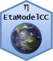

<!-- README.md is generated from README.Rmd. Please edit that file -->

# EtaModelCC <a href='https://github.com/holbig/EtaModelCC'></a>

<!-- badges: start -->

[](https://www.repostatus.org/#active)
[](https://www.tidyverse.org/lifecycle/#experimental)
<!-- badges: end -->

## Overview

**EtaModelCC** is a R package to access high resolution climate change
projections over Central and South America of
[PROJETA](https://projeta.cptec.inpe.br/) plataform
([CPTEC/INPE](http://www.cptec.inpe.br)) using the [Eta
model](http://etamodel.cptec.inpe.br). The **EtaModelCC** is developed
by Mosaico research group at [University of Passo
Fundo](https://www.upf.br) (Brazil).

## Getting started and citation

If you are just getting started with **EtaModelCC** we recommend
starting with the [description of PROJETA
project](https://projeta.cptec.inpe.br/#/about) and the paper:

  - Hölbig et al. (2018). **PROJETA platform: accessing high resolution
    climate change projections over Central and South America using the
    Eta model**. *Agrometeoros*, 26(1): 71-81. DOI:
    [10.31062/agrom.v26i1.26366](http://dx.doi.org/10.31062/agrom.v26i1.26366).

When the **EtaModelCC** package is used in the development of academic
works and publications, please use the following bibliographical
reference in the references:

  - Dezordi, M. et a. (2018). **An R package to access climate change
    data for South America regionalized by the Eta Model of
    CPTEC/INPE**. In *Anais do IX Workshop de Computação Aplicada a
    Gestão do Meio Ambiente e Recursos Naturais*. Porto Alegre: SBC.
    DOI:
    [10.5753/wcama.2018.2934](http://dx.doi.org/10.5753/wcama.2018.2934).

## Instalation from GitHub

``` r
if (!require(devtools)) {
  install.packages("devtools")
}

devtools::install_github("holbig/EtaModelCC")
```

## Documentation

More documentation is available in the vignette in your R session
**`vignette("EtaModelCC")`**.

## Use of Projeta Data

When the Projeta data are used in the development of academic works and
publications, please use the following text as references for the
CPTEC/INPE data source:

> “Data generated by the CPTEC/INPE and available on the platform
> Projeta”

and the bibliography references:

  - Chou, S.C, Lyra, A. , Mourão, C. , Dereczynski, C. , Pilotto, I. ,
    Gomes, J. , Bustamante, J. , Tavares, P. , Silva, A. , Rodrigues, D.
    , Campos, D. , Chagas, D. , Sueiro, G. , Siqueira, G. , Nobre, P.
    and Marengo, J. (2014) Evaluation of the Eta Simulations Nested in
    Three Global Climate Models. *American Journal of Climate Change*,
    3, 438-454. DOI:
    [10.4236/ajcc.2014.35039](http://www.scirp.org/journal/PaperInformation.aspx?PaperID=52887#.VakHg_lViko).

  - Chou, S.C, Lyra, A. , Mourão, C. , Dereczynski, C. , Pilotto, I. ,
    Gomes, J. , Bustamante, J. , Tavares, P. , Silva, A. , Rodrigues, D.
    , Campos, D. , Chagas, D. , Sueiro, G. , Siqueira, G. and Marengo,
    J. (2014) Assessment of Climate Change over South America under RCP
    4.5 and 8.5 Downscaling Scenarios. *American Journal of Climate
    Change*, 3, 512-527. DOI:
    [10.4236/ajcc.2014.35043](http://www.scirp.org/journal/PaperInformation.aspx?PaperID=52877#.VakIh_lVikp).

  - Lyra, A., Tavares, P., Chou, S.C., Sueiro, G., Dereczynski, C.P.,
    Sondermann, M., Silva, A., Marengo, J., Giarolla, A. 2017. Climate
    change projections over three metropolitan regions in Southeast
    Brazil using the non-hydrostatic Eta regional climate model at 5-km
    resolution. *Theor Appl Climatol*. DOI:
    [10.1007/s00704-017-2067-z](https://link.springer.com/article/10.1007/s00704-017-2067-z).

  - Terceira Comunicação Nacional do Brasil à Convenção-Quadro das
    Nações Unidas sobre Mudança do Clima
    
      - [Executive
        Summary](http://unfccc.int/resource/docs/natc/branc3es.pdf)
      - [Volume 1](http://unfccc.int/resource/docs/natc/branc3v1.pdf)
      - [Volume 2](http://unfccc.int/resource/docs/natc/branc3v2.pdf)
      - [Volume 3](http://unfccc.int/resource/docs/natc/branc3v3.pdf)

## Meta

  - Please [report any issues or
    bugs](https://github.com/holbig/EtaModelCC/issues).

  - License: [BSD-3
    clause](https://github.com/holbig/EtaModelCC/blob/master/LICENSE)

  - Get citation information for **EtaModelCC** in R by typing
    **`citation(package = "EtaModelCC")`**.
